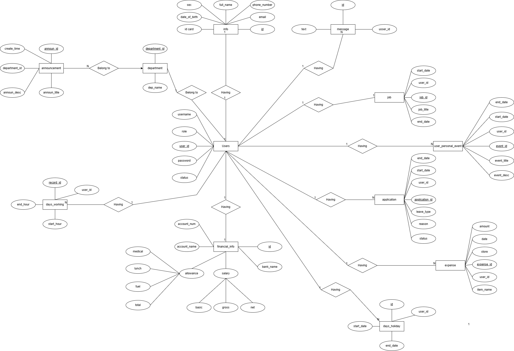

# Humans-Resource-Management-System
## Team members
- UI/UX Designer: Nguyễn Thanh Tùng
- Frontend User Developer: Đỗ Hồng Quân
- Frontend Admin Developer: Nguyễn Tất Huấn
- Backend Developer: Nguyễn Trung Hiếu


## 📋 Project Description
This project is a **Human Resource Management System** (HRMS) designed to streamline the management of employee data, attendance, payroll, and performance reviews. Built with scalability and ease of use in mind, this system provides HR teams with an efficient tool for managing essential workforce processes.

## 🚀 Features
- Employee information management
- Attendance tracking
- Payroll generation
- Performance evaluation and reports
- Role-based access control (Admin, Employee)

## 🏗️ Tech Stack
- **Backend:** Python, FastAPI, SQLAlchemy
- **Frontend:** React.js, Vite
- **Database:** PostgreSQL
- **Authentication:** JWT + Gmail OTP (Two-Factor Authentication)
- **Containerization:** Docker

---

## 📂 Directory Structure
```
.
├── backend
│   ├── alembic             # Database migrations
│   ├── app                 # Main backend application
│   ├── backend.Dockerfile  # Dockerfile for backend service
│   ├── docker-compose.yml  # Docker Compose file for backend
│   ├── .env.example        # Example environment variables
│   ├── requirements.txt    # Python dependencies
├── design
│   ├── .gitkeep            # Placeholder for design assets
├── docs
│   ├── erd-diagram.png     # Entity-Relationship Diagram
│   └── figma-design.png    # Link or snapshot of the Figma design
├── frontend
│   ├── public              # Static assets for the frontend
│   ├── src                 # React source files
│   ├── Dockerfile          # Dockerfile for frontend service
│   ├── docker-compose.yml  # Docker Compose file for frontend
│   ├── tailwind.config.js  # TailwindCSS configuration
│   ├── vite.config.js      # Vite configuration
│   ├── package.json        # Frontend dependencies
├── admin_hr_management
│   ├── public              # Static assets for admin panel
│   ├── src                 # React source files
│   ├── Dockerfile          # Dockerfile for admin panel service
│   ├── docker-compose.yml  # Docker Compose file for admin panel
│   ├── jsconfig.json       # JavaScript configuration
│   ├── package.json        # Admin panel dependencies
├── nginx
│   ├── Dockerfile          # Dockerfile for NGINX reverse proxy
│   ├── docker-compose.yml  # Docker Compose file for NGINX
│   ├── README.md           # NGINX configuration details
│   ├── .dockerignore       # Docker ignore rules for NGINX
└── README.md               # Project documentation
```

---

## 🎨 Figma Design
Access the design prototype [here](https://www.figma.com/design/tbEnJE5uA1bJqBOZkTS4lW/Human_resource_management?node-id=106-172&t=h3qKWuTUvV8fgsFA-1).

---

## 📊 Entity Relationship Diagram (ERD)
Below is the ERD for the database structure. It outlines the relationships between entities such as Users, User_personal_info, User_personal_finance, Department,... 



---

## ⚙️ Installation & Setup
### Prerequisites
- Python 3.10+
- PostgreSQL
- Docker

### Steps
1. Clone the repository:
   ```bash
   git clone https://github.com/HRMS-HUS/Humans-Resource-Management-System.git
   ```
2. Navigate to the project directory:
   ```bash
   cd Humans-Resource-Management-System
   ```
3. Set up environment variables:
   - Copy the example environment file:
     ```bash
     cp backend/.env.example backend/.env
     ```
   - Edit the `.env` file with your configuration.
4. Start all services using Docker Compose:
   ```bash
   docker-compose up --build
   ```
5. Access the application:
   - Backend API: `http://localhost:8000`
   - User: `http://localhost:5174`
   - Admin Panel: `http://localhost:5173`

---


## 📚 Documentation
API documentation is available [here]([./docs/api-documentation.md](https://documenter.getpostman.com/view/39140159/2sAYQakWWe)).

---

## 📬 Contribution Guidelines
We welcome contributions! Please read our [Contributing Guide](./CONTRIBUTING.md) for details on our code of conduct and the process for submitting pull requests.

---

## 📜 License
This project is licensed under the MIT License. See the [LICENSE](./LICENSE) file for details.
